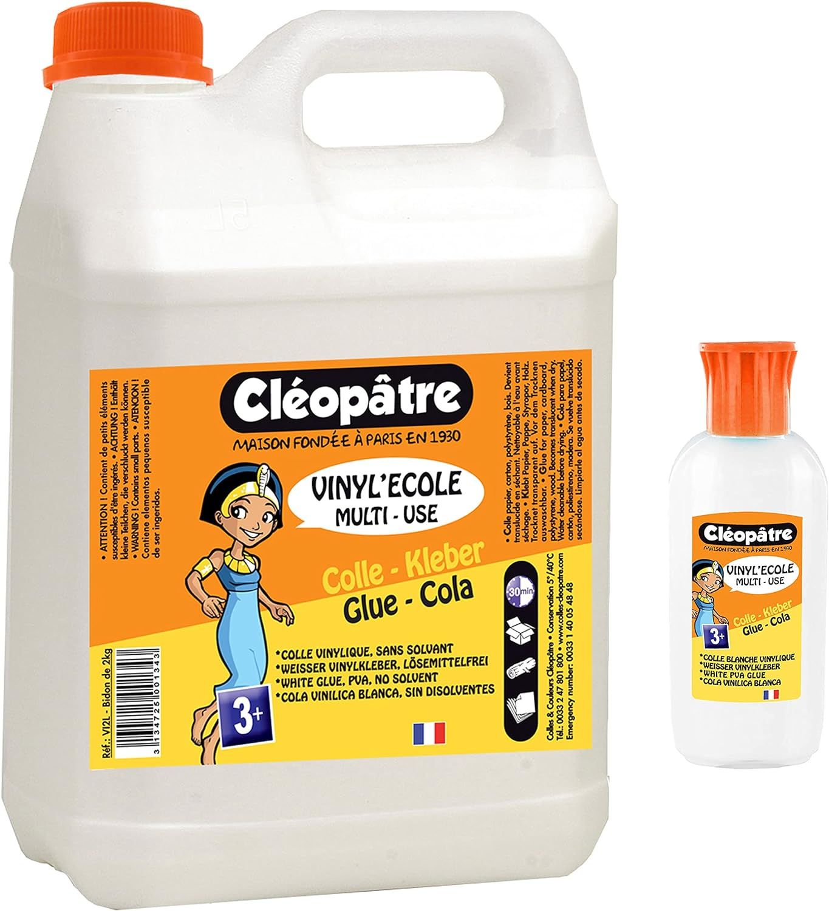
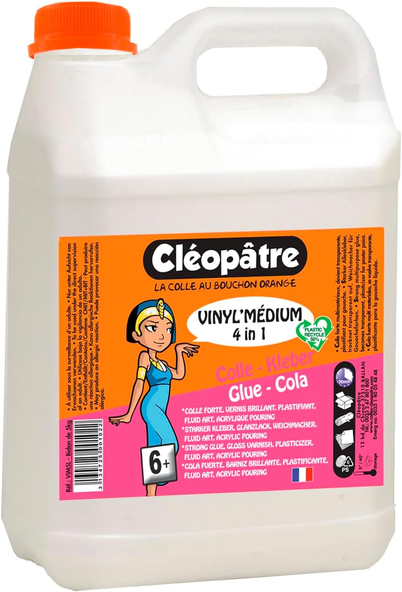

# Recherches et expériences médiums de lissage

Un médium de lissage est un liquide permettant de diluer et liquéfier l'acrylique tout en conservant ses propriétés structurelles. En comparaison, diluer avec de l'eau pure augmente le risque que la peinture craquelle en séchant.  
Le médium de lissage peut avoir d'autres effets, comme augmenter le temps de séchage de la peinture ou diminuer le mélange des couleurs.  

Il existe de nombreux médiums prêts à l'emploi. Certains que j'ai déjà 

# Médiums testés personnellement

## Eau

Très bien en l'absence d'autre médium. Permet de tester si le pouring nous plaît.  
Mais la peinture craquelle au séchage.

##  Colle blanche polyvinylique

### Théorie

**Principe** : contient des polymères ressemblant à ceux de l'acrylique[^1]. 

**Avantage principal** : prix et viscosité.

[^1]: https://www.facebook.com/groups/1105002916712321/learning_content/?filter=4357375347699357

### Pratique

Personnellement, j'utilise la colle de marque Cléopatre, soit Vinyl'Ecole soit Vinyl'Médium.  

J'ai testé plusieurs mélanges : 

- 50% colle + 50% peinture : mélange très visqueux, idéal pour peindre sur des objets.
- 33% colle % 33% peinture + 33% eau : mélange assez fluide pour du straight pour.

         

## Médium de lissage action

Très bon marché mais difficile à trouver.   
La peinture obtenue est très liquide, ce qui ne me convient pas. Je l'utilise parfois pour diluer un mélange peinture + médium de lissage trop visqueux.

# Médiums à tester

### Easycryl

**En théorie **: Médium initialement créé pour la peinture murale. En ralentissant le temps de séchage de la peinture, cela permet d'éviter d'avoir des traces dues aux différents passages du pinceau. L'easycryl peut être appliqué à l'acrylique pouring[2].

[2]: https://www.facebook.com/groups/1105002916712321/learning_content/?filter=4357375347699357 

**Problème** : Difficile de trouveer la dose idéale pour le mélange avec l'acrylique (variable selon le type d'acrylique).

### Floetrol owatrol

**Attention** : le filtrer pour evter qe des couleurs visqueuses ne passent

Mélanger 1/1/1 avec de l'acrylique et de l'eau

### Mélange 1/1 médium Action et colle cléopatre

# Sources
[Guides de l'association PICTURA AND CO](https://www.facebook.com/groups/1105002916712321/learning_content)