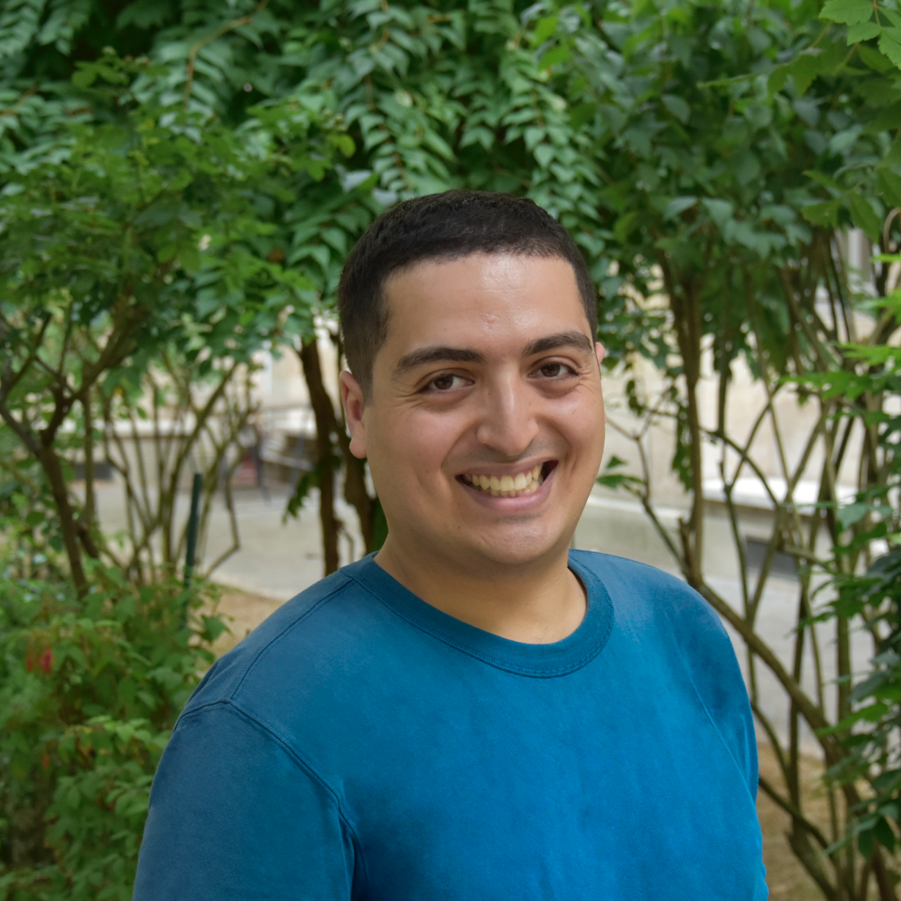

<!-- <head>
    <meta charset="UTF-8">
    <meta name="photo" content="width=device-width, initial-scale=1.0">
    
</head>

      -->

Médecin et chercheur, je viens de terminer le second cycle de mes études de Médecine. Je m'apprête à entamer un internat d'allergologie à Paris en novembre 2024.

En recherche, je m'intéresse à l'analyse de données à grande échelle et au machine learning, notamment au développement du machine learning interprétable pour la santé.

Comme activité secondaire, je consulte en analyse de données avec mon entreprise [ADOS Conseil](https://ados-conseil.github.io/). Je réalise notamment des études statistiques pour des thèses en médecine et des projets de recherche.

# Nouveautés

* **13/09/24** : Affectation d'interne en Allergologie à l'AP-HP, mon premier choix 😊   

  
* **Juillet 2024** : Elu VP Informatique de l'Association Nationale des Doubles Cursus en Santé (ANDCS)

# Formations

**2024 :** Diplôme de Formation Approfondies en Sciences Médicales, *Sorbonne Université*

**2021 :** Master en Chimie pour les Sciences du Vivant, *ENS Ulm - Université PSL*

**2020 :** Master en Informatique, *Sorbonne Université*

**2019 :** Troisième année du cycle ingénieur, *Ecole polytechnique*

# Contact

Pour une collaboration, vous pouvez me contacter via [Linkedin](https://www.linkedin.com/in/yanis-bendjelal/?locale=fr_FR).  
Pour une mission d'analyse de données, je suis disponible [ici](https://ados-conseil.github.io/).
